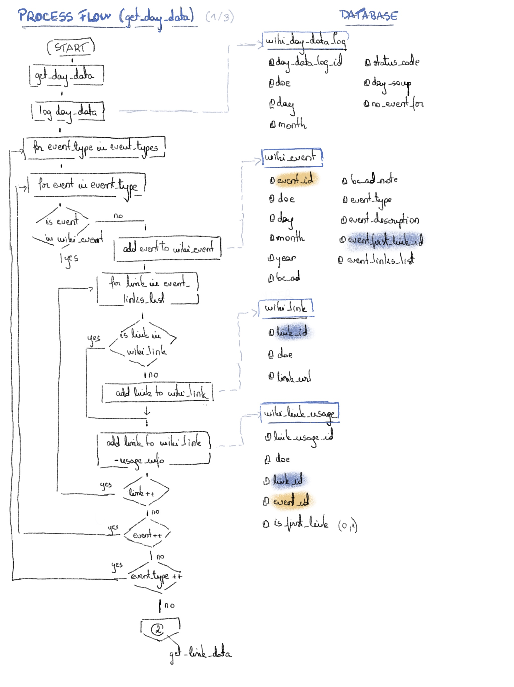

This is part one of project TADS_this_day_in_history. The goal of this part is to build a dataset of events for each day of the year by using the Wikipedia API and by supplementing the Wikipedia data with other data that makes it possible to geoplot events and rank events based on importance.

The two subfolders in this folder are:
1. notebooks: it contains the jupyter notebooks I used to figure out the Wikipedia API and write the code for building the dataset
2. build_dataset: it contains the cleaned-up code

Building the TADS_this_day_in_history dataset consists of four steps:
1. [get day data](#1-get-day-data)
2. [get link data](#2-get-link-data)
3. [get image data](#3-get-image-data)
4. [supplement_data](#4-supplement-data)

The processes for each step are shown in the diagrams below.

### 1. get day data

### 2. get link data

### 3. get image data

### 4. supplement data

<small>diagram placeholder</small>