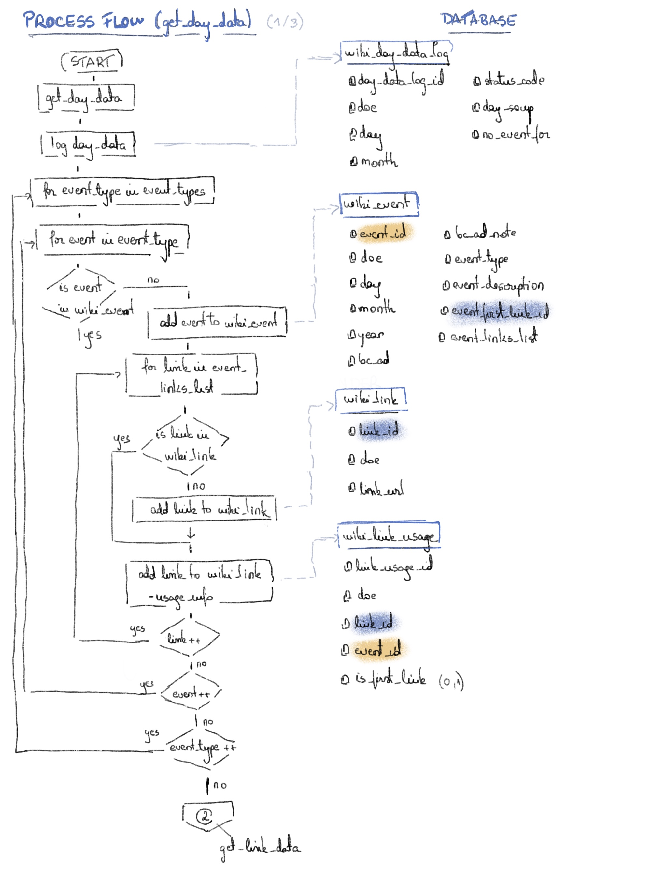
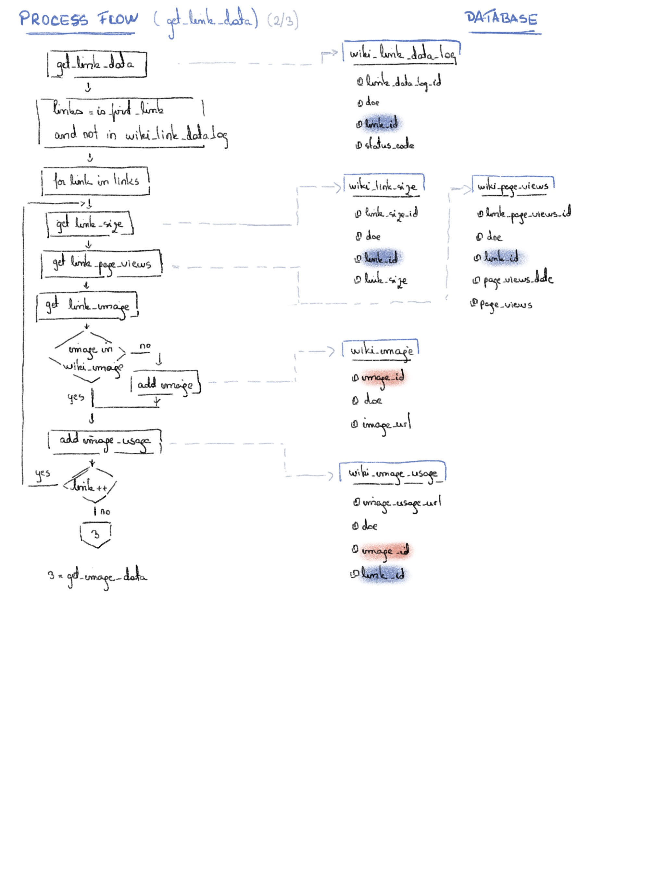
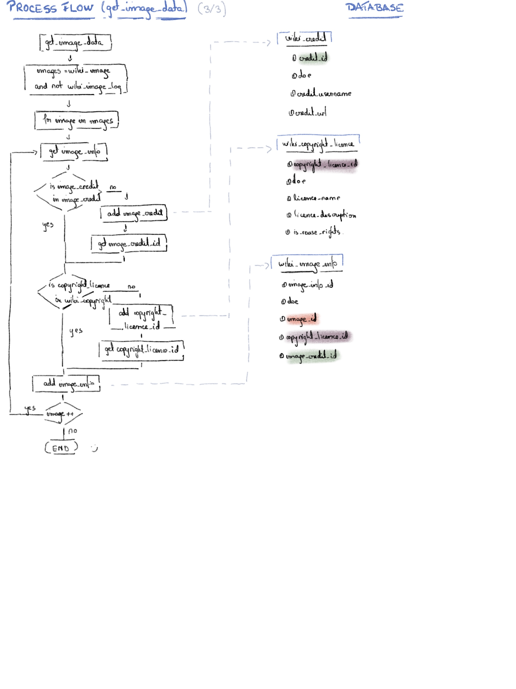

Building the wikipedia_this_day_in_history dataset consists of three steps:
1. [get day data][id_get_day_data]
2. [get link data][id_get_link_data]
3. [get image data][id_get_image_data]

The processes for each step are diagramed as shown below.

1. [id_get_day_data]: get day data

2. [id_get_link_data]: get link data

3. [id_get_image_data]: get image data

